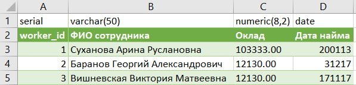
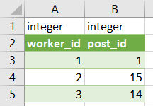
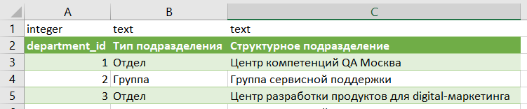
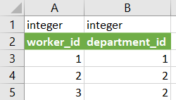
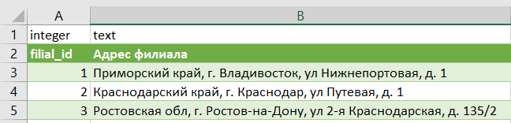
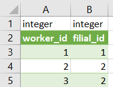
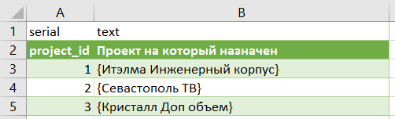
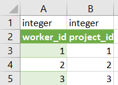
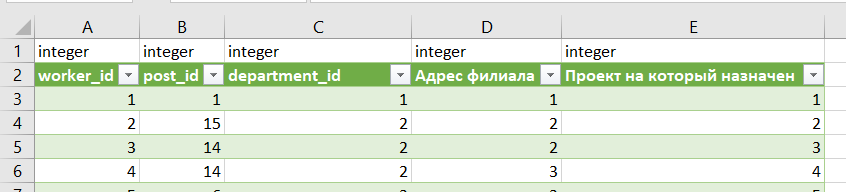

# Домашнее задание к занятию "`12-01hw`" - `Ливчак Сергей`

---

### Задание 1

`Опишите не менее семи таблиц, из которых состоит база данных:`
   `какие данные хранятся в этих таблицах;`
   `какой тип данных у столбцов в этих таблицах, если данные хранятся в PostgreSQL.`

1. **worker_id** 

2. **post_id** 

3. **worker-post_id** 

4. **department_id** 

5. **worker-department_id** 

6. **filial_id** 

7. **worker-filial_id** 

8. **project_id** 

9. **worker_project** 

10. **3nf** 

Сыылка на переделанный документ
[hw-12-1_(nf4).xlsx](excel/hw-12-1_(nf4).xlsx) 

---

## Дополнительные задания (со звездочкой*)

### Задание 2

`Перечислите, какие, на ваш взгляд, в этой денормализованной таблице встречаются функциональные зависимости и какие правила вывода нужно применить, чтобы нормализовать данные.`

Функциональные зависимости которые я заметил.
1. должность - оклад
2. тип подразделения - структурное подразделение
3. проект  - адрес филиала
4. сотрудник - проект

Чтобы нормализовать данные нужно для начала нормализовать по 1nf - вывести все смысловые значения полей в отдельные таблицы (атомизировать данные). Перейти к 2nf - разделить на таблицы чтобы не было зависимости неключевых атрибутов от части составного ключа. Перейти к 3nf - избавится от транзитивной зависимости (чтобы не было ссылки на ссылку в другой таблице). Перейти к 4nf - избавиться от многозначных зависимостей (чтобы в одной таблице неключевые аргументы не могли сочетаться между собой в разных комбинациях)
